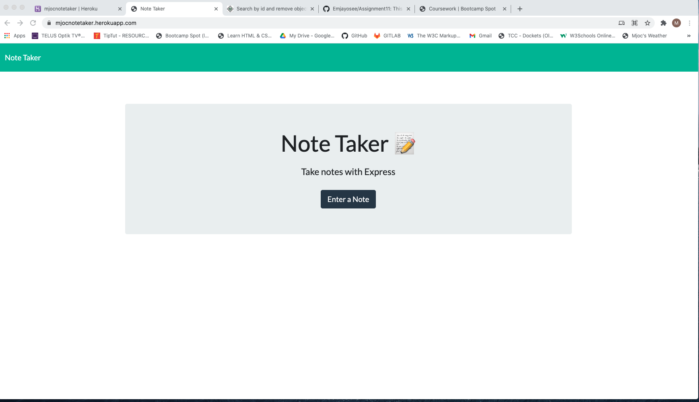
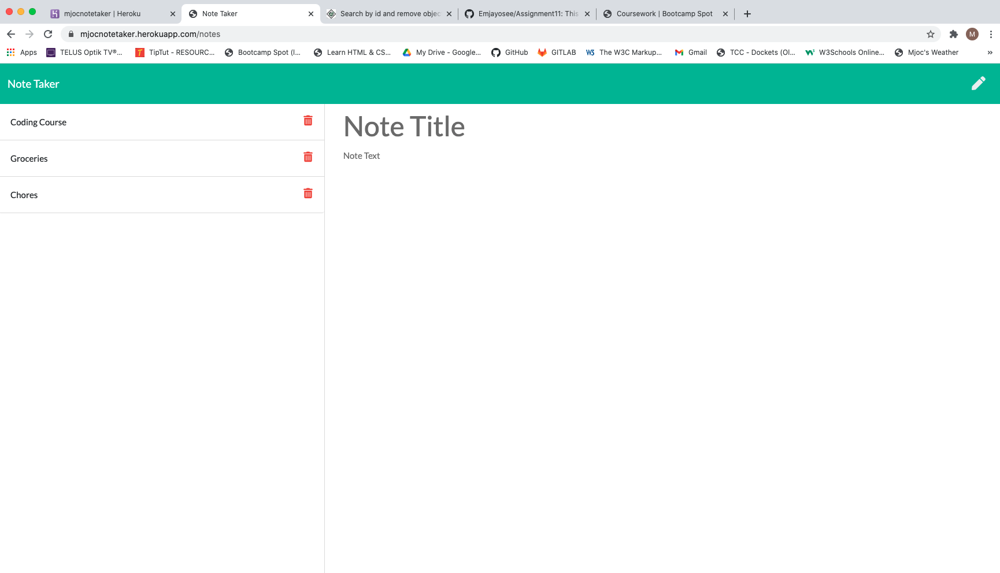

# Assignment11

This is the repo for Assignment 11 due February 19, 2021.

Here is a link to the app on Heroku https://mjocnotetaker.herokuapp.com/ and a link to the GitHub Folder https://github.com/Emjayosee/Assignment11. 

# Unit 10: Team Profile Generator

Submitted: March 11, 2021, Michael O'Connor, 604 765 6061

   * [01 Goal](#01-goal)
   * [02 Approach](#02-approach)
   * [03 Deliverable Requirements](#03-deliverable-requirements)
   * [04 Testing and Quality Control](#04-testing-and-quality-control)
   * [05 Lessons Learned](#05-lessons-learned)
   * [06 Further Developments](#06-further-developments)
   * [07 Current Renderings:](#07-current-renderings)
   * [08 Installation Instructions](#08-installation-instructions)
   * [09 Usage Info:](#09-usage-info)
   * [10 Contribution Guidelines](#10-contribution-guidelines)
   * [11 Licence](#11-licence)
   * [12 Questions](#12-questions)

# 01 Goal: 

    The goal is to modify starter code to create an application called Note Taker that can be used to write and save notes. This application will use an Express.js back end and will save and retrieve note data from a JSON file. The application’s front end has already been created. It's your job to build the back end, connect the two, and then deploy the entire application to Heroku.

# 02 Approach:

    In approaching this project, I at first struggled to get the inquirer routine going.  Then after
    a tutorial, I was able to do so but still needed to develop the unique requirements for each team
    member.  To simplify the inputs, I studied how to work with switch statements and then created 
    the same data routine for all employees, but switched the final question depending on the role 
    of the person.  THis I felt made more sense in case there ever was an "inband" reporting situation.

    Acceptance requirements include: 
            
            [X] GIVEN a note-taking application, when the NOte Taker is opened a landing page with a link to a enter a new note is offered
            [X] When the user clicks on the link to add a new note, a page with existing notes listed in the left-hand column, plus empty fields to enter a new note title and the note’s text in the right-hand column is presented
            [X]The User enters a new note title and the note’s text and a Save icon appears in the navigation at the top of the page
            [X] When the Save icon is clicked, the new note entered is saved and appears in the left-hand column with the other existing notes
            [X] Wen the user clicks on an existing note in the list in the left-hand column that note appears in 

    I was able to review a number of the examples in the class session to get a feel for  how to set up the API endpoints to display, but I needed further help from Tutor to get the app to connect fully.  I had no issue with loading the app into Heroku.  I thought about attempting to develop the delet feature, but since I was behind on assigments, I passed.  I did find some useful info here on how to do that with a JSON array https://www.tutorialspoint.com/search-by-id-and-remove-object-from-json-array-in-javascript. 

# 03 Deliverable Requirements:

The project requires the following be submitted: 

            [X] The URL of the functional, deployed application https://mjocnotetaker.herokuapp.com/.

            [X] The URL of the GitHub repository. Give the repository a unique name and include a README describing the project https://github.com/Emjayosee/Assignment11.

# 04 Testing and Quality Control:

    Testing included:

        [X] Entereing some notes;
        [X] Landing on the main page and proceeding to the enter notes; and
        [X] Running the app from Heroku and my iphone.

# 05 Lessons Learned:

The following topics were applied during the project:

    * How to work with someone else's code

    * Linking a GitHub app with Heroku

    * Using a JSON array in a database

    * How to use get and post

# 06 Further Developments:

    No further developments are pending.

# 07 Current Renderings:

Images of the deployed app can be found here:

# 08 Installation Instructions: 

Be sure to do an npm install.

# 09 Usage Info: 

There is no app to use.

# 10 Contribution Guidelines: 

I do not expect to develop this any further.

# 11 Licence: 

 NA

# 12 Questions: 

If there are any questions please contact me. 
